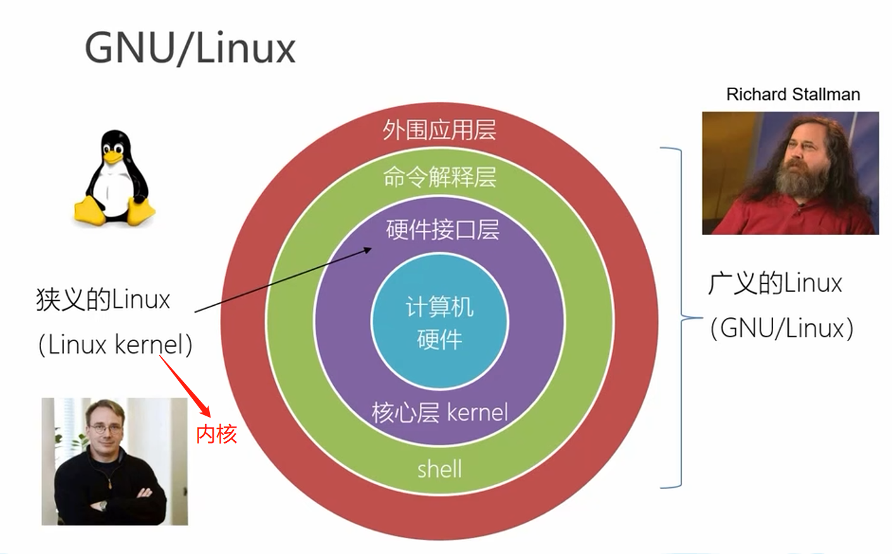
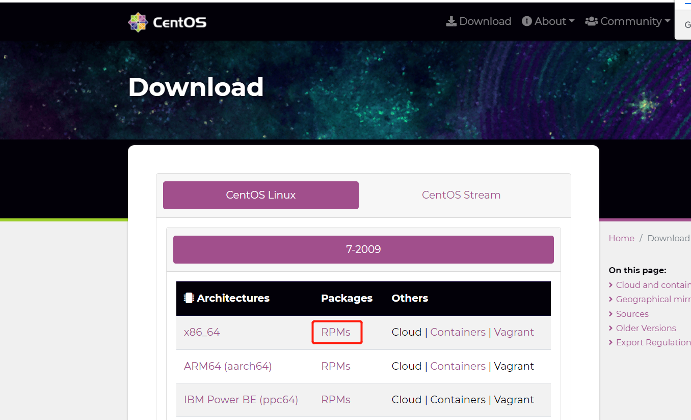
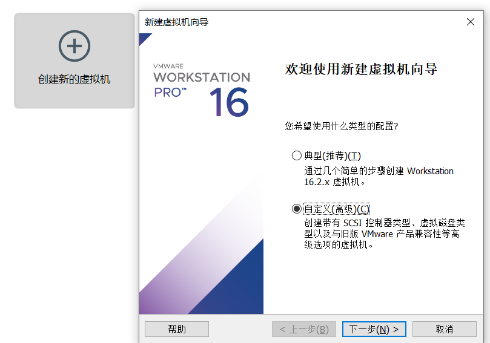
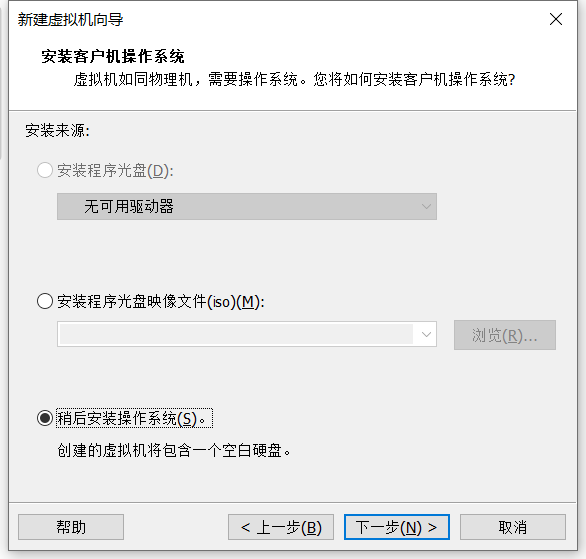
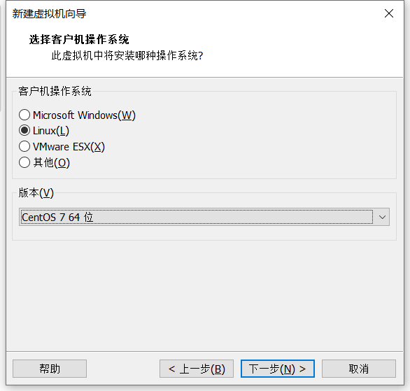
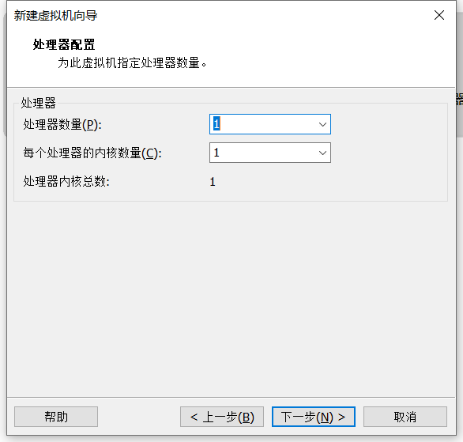
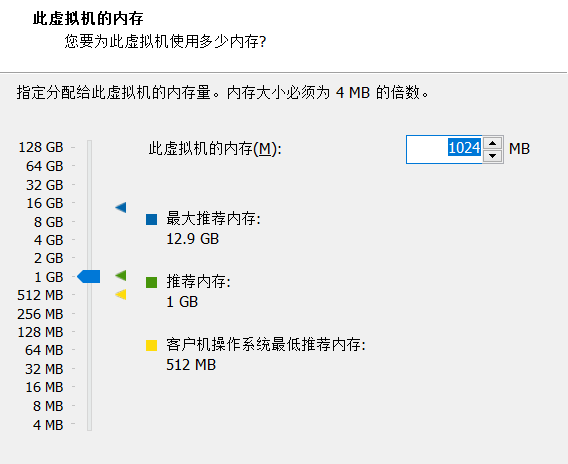

# Linux学习

## 逻辑分层

**狭义的Linux**：Linux kernel（Linux内核），位于核心层，是操作系统的核心部分。

**广义的Linux**：GNU/Linux，包含硬件接口层（核心层）、命令解释层、外围应用层，不同的发行版本可能不同。

> 同一个Linux内核可以搭配不同的命令解释层、外围应用层等，构成了不同的Linux发行版本。

## Linux发行版本

* Red Hat
  没有好看的界面，但是性能好

  * Red Hat Enterprise Linux（RHEL）  企业版
  * fedora （实验版本，迭代快、版本新、不稳定）
  * **CentOS**（基于企业版去除有版权的代码等的稳定版本）（界面不好，稳定、性能强）

* debian
  社区类Linux的典范

  * ubuntu（页面比较华丽）

* Suse

* Arch Linux

  轻量、灵活、新手上手难度大

## CentOS安装

> 红帽系的包管理工具是rpm，更高级的事yum。Ubuntu的包管理工具是apt。

### 下载镜像

[CentOS官网](https://www.centos.org/)

### 下载VMWare

[VMWare官网](https://www.vmware.com/cn/products/workstation-pro.html)

workstation-pro 是收费版

workstation--play 是个人版，相比较收费版会缺少功能

### 创建虚拟机（相当于买了台电脑）

1个cpu里有8个内核，8个内核由于超线程技术，每个内核可以拓展出2个逻辑处理器，所以是8核16线程。

后面都用默认配置即可。

### 安装系统

