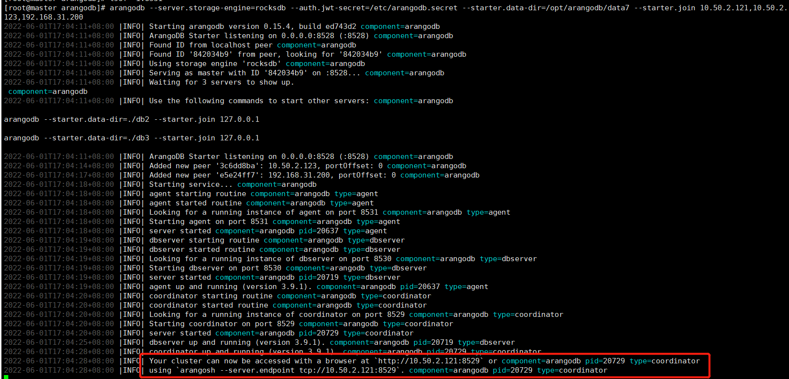
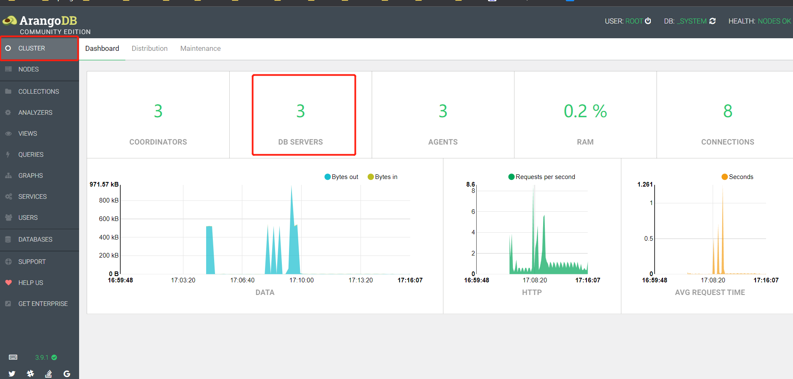
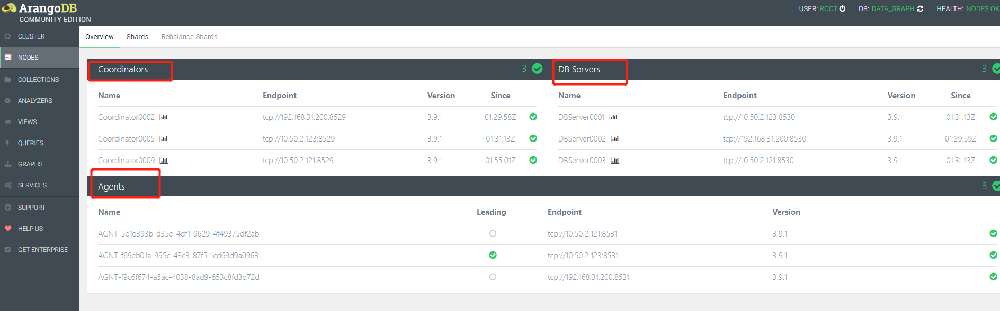
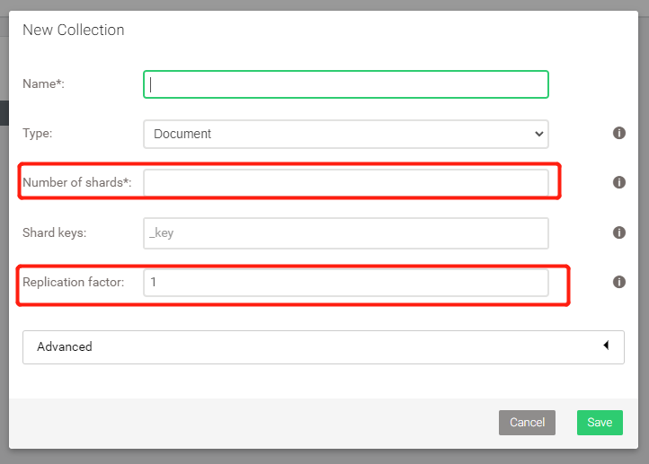
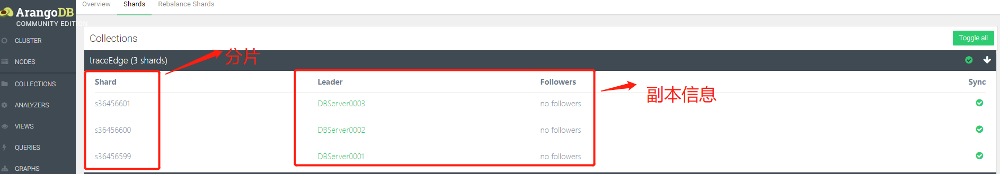

# ArangoDB

## **

## **

## 部署

### 单机

#### rpm

1. 下载rpm包

2. 安装

   ``` shell
   rpm -ivh arangodb3-3.9.1-1.0.x86_64.rpm
   ```

3. 修改密码

   ``` shell
   arango-secure-installation
   ```

4. 修改配置

   ``` shell
   vim /etc/arangodb3/arangod.conf
   ```

   将endpoint = tcp://127.0.0.1:8529中的127.0.0.1更改为主机ip

5. 开启arangodb

   ``` shell
   service arangodb3 start
   #service arangodb3 stop #关闭arangoDB
   #service arangodb3 restart #重启arangoDB
   #service arangodb3 status # 查看arangoDB的状态
   ```

#### docker

``` shell
docker run -e ARANGO_ROOT_PASSWORD=123456 -p 8529:8529 --name arangodb -d arangodb/arangodb
```

### 集群

集群有4个节点：

* Agent：集群的配置中心，Raft一致性协议解决配置冲突，高可用的KV存储。
* Coordinator：接收客户端请求，无状态，与Primary交互。
* Primary：主存储节点，多个，所谓的`主-主`指的就是它了。
* Secondary：可选，可以理解成Primary的备份。

#### Mesos/DCOS

Mesos/DCOS是官方首推的集群方案，官方性能测试也是在此环境上进行的。但搭建DCOS至少需要5台机器，一旦搭好了DCOS，后面会非常简单。目前来看，项目中配置机器数量不会达到5台，故此方案不适用。

#### Docker/Compose

Docker/Compose是另外一套比较好的方案，官方有提供Docker镜像，使用Compose编排集群内的节点，使用起来会非常灵活，又一目了然。

#### ArangoDB-Starter

[官网参考](https://www.arangodb.com/docs/stable/deployment-cluster-using-the-starter.html)

1. 先在每个服务器上安装arangodb

2. 生成秘钥，放置`/etc`目录下

   ``` shell
   arangodb create jwt-secret --secret=arangodb.secret
   ```

3. 改变秘钥文件权限

   ``` shell
   chmod 400 arangodb.secret
   ```

4. 将这份文件复制到别的服务器中的`/etc`目录，并且也改变秘钥文件的权限

5. 检查各个服务器`8528/8529/8530/8531`端口是否开放。其中`8529`是Coordinators、`8530`是DbServers、`8531`是Agents

6. 在每台服务器中都执行如下命令（依据官网）

   ``` shell
   # starter.data-dir 目录自定义即可，用于存放日志以及数据
   arangodb --server.storage-engine=rocksdb --auth.jwt-secret=/etc/arangodb.secret --starter.data-dir=/opt/arangodb/data --starter.join 10.50.2.121,10.50.2.123,192.168.31.200
   ```

7. 看到如下图片代表启动成功
   

8. 访问`10.50.2.121:8529`页面，账号为`root`，密码不需要填写即可进入。
   
   
9. 可以看到集群中Coordinators、DB Servers、Agents的信息
   

10. 新建Collection时还可以选择其分片数和副本数，Arango会自动负载均衡到集群节点中
   

11. 查看分片以及副本信息
    

##### 参考链接

https://fangniude.github.io/ArangoDB%E9%9B%86%E7%BE%A4/
https://zhuanlan.zhihu.com/p/461651389

